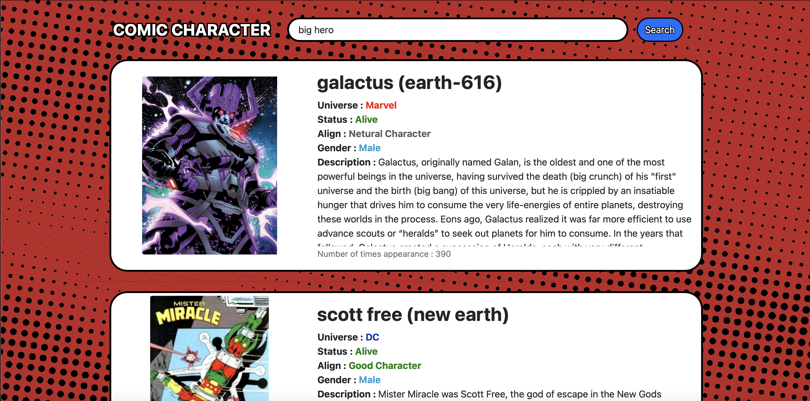

# Comic Character Searchengine
A superhero search engine that uses data from dataset.io and utilizes Elasticsearch and Kibana for indexing and querying the data, along with Flask for displaying the information on the website. The website allows users to search for and view detailed information about their favorite superheroes, highlighting my ability to work with Elasticsearch

to run the service you will need to install kibana and elastic first
```
for linux user : https://www.elastic.co/guide/en/kibana/current/docker.html
```
```
for window user : https://www.elastic.co/guide/en/kibana/current/windows.html
```
After that you will need to install python3 and flask
```
Instruction : https://phoenixnap.com/kb/install-flask
```

Next, you will need to import the csv provided in the folder to you kibana, 
Now you have finished the setup process

also set your elastic password in search_app.py to match you password
```
ELASTIC_PASSWORD = "YOUR_PASSWORD"
```

To run the program type in the cmd same as the file directory

for linux & mac
```
export FLASK_APP=search_app.py
flask run
```
for window
```
set FLASK_APP=search_app.py
flask run
```
Now the Search engine should work on port 5000

Snapshot of the Search Engine :



